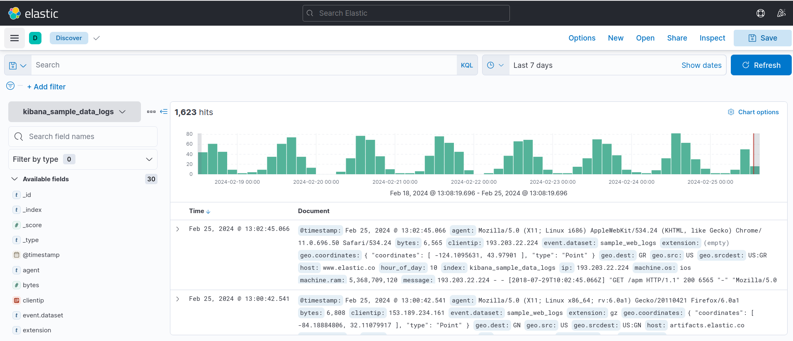

## Стенд с Vagrant c Rsyslog

**Цель домашнего задания**
Научится проектировать централизованный сбор логов. Рассмотреть особенности разных платформ для сбора логов.

**Описание домашнего задания**
1. В Vagrant разворачиваем 2 виртуальные машины web и log
2. на web настраиваем nginx
3. на log настраиваем центральный лог сервер на любой системе на выбор
journald;
rsyslog;
elk.
4. настраиваем аудит, следящий за изменением конфигов nginx 

Все критичные логи с web должны собираться и локально и удаленно.
Все логи с nginx должны уходить на удаленный сервер (локально только критичные).
Логи аудита должны также уходить на удаленную систему.

Формат сдачи ДЗ - vagrant + ansible


**Дополнительное задание**
развернуть еще машину с elk
- настроить 2 центральных лог системы elk и какую либо еще;
- в elk должны уходить только логи нжинкса;
- во вторую систему все остальное.

Статус "Принято" ставится, если присылаете логи скриншоты без вагранта.
Задание со звездочкой  выполняется по желанию.


### Введение

Функция системного журналирования (логирование) – это основной источник информации о работе системы и ошибках.
В системе Linux почти все действия записываются. Именно эти данные помогают разбираться в проблемах с ОС.

Логи могут храниться как локально, так и пересылаться на удаленную систему. Пересылка логов имеет следующие
плюсы:

- Возможность централизованного сбора и анализа логов. Все логи со всех устройств прилетают в одно место. Это значительно упростит работу с логами.
- Защита от удаления логов на локальной машине.
- Оптимизация места на диске в локальной ОС. Логи не будут храниться в ОС, т.к. будут сразу пересылаться в систему сбора логов. Данная функция настраивается отдельно.

В ОС Linux главным файлом локального журналирования является:

- Ubuntu/Debian — /var/log/syslog
- RHEL/CentOS — /var/log/messages

Логи в ОС можно настроить. Например, указывать больше информации или отключить логирование конкретного компонента.

Помимо логов, в Unix-системах используют аудит.  
В linux эту функцию выполнеят linux audit daemon.

Linux Audit Daemon – это среда, позволяющая проводить аудит событий в системе Linux. Используя мощную систему аудита возможно отслеживать многие типы событий для
мониторинга и проверки системы, например:

- доступ к файлам;
- изменение прав на файлы;
- просмотр пользователей, изменивших конкретный файл;
- обнаружение несанкционированных изменений;
- мониторинг системных вызовов и функций;
- обнаружение аномалий, таких как сбои;
- мониторинг набора команд.

Аудит различает 4 вида доступа к файлу:

- r — чтение
- w — запись в файл
- x — выполнение файла
- a — изменение атрибута

### Для выполнения необходимо:

ПК на Unix c 8ГБ ОЗУ или виртуальная машина с включенной Nested Virtualization. Предварительно установленное и настроенное следующее ПО:

1. Hashicorp Vagrant <https://www.vagrantup.com/downloads>
2. Oracle VirtualBox <https://www.virtualbox.org/wiki/Linux_Downloads>
3. Ansible (версия 2.7 и выше) <https://docs.ansible.com/ansible/latest/installation_guide/intro_installation.html>

### Создать виртуальные машины

- Создать каталог, в котором будут храниться настройки виртуальной машины. В каталоге создать файл с именем [Vagrantfile](./Vagrantfile_old)
- Результатом выполнения команды vagrant up станут созданные виртуальные машины
- Заходим на web-сервер: vagrant ssh web

>- Дальнейшие действия выполняются от пользователя root

- Переходим в root пользователя

```
elena_leb@ubuntunbleb:~/LOG_DZ$ vagrant ssh web
[vagrant@web ~]$ sudo -i

```
- Для правильной работы c логами, нужно, чтобы на всех хостах было настроено одинаковое время. Прописать часовой пояс Europe/Moscow 
```bash
[root@web ~]# \cp /usr/share/zoneinfo/Europe/Moscow /etc/localtime
```
- Перезупустить службу NTP Chrony:
```bash
[root@web ~]# systemctl restart chronyd
```
- Проверить, что служба работает корректно:
```
systemctl status chronyd
```
- Проверить, что время и дата указаны правильно
```
date
```
```
[vagrant@web ~]$ sudo -i
[root@web ~]# \cp /usr/share/zoneinfo/Europe/Moscow /etc/localtime
[root@web ~]# systemctl restart chronyd
[root@web ~]# systemctl status chronyd
● chronyd.service - NTP client/server
   Loaded: loaded (/usr/lib/systemd/system/chronyd.service; enabled; vendor preset: enabled)
   Active: active (running) since Sun 2024-02-11 13:25:51 MSK; 26s ago
     Docs: man:chronyd(8)
           man:chrony.conf(5)
  Process: 2589 ExecStartPost=/usr/libexec/chrony-helper update-daemon (code=exited, status=0/SUCCESS)
  Process: 2585 ExecStart=/usr/sbin/chronyd $OPTIONS (code=exited, status=0/SUCCESS)
 Main PID: 2587 (chronyd)
   CGroup: /system.slice/chronyd.service
           └─2587 /usr/sbin/chronyd

Feb 11 13:25:51 web systemd[1]: Stopped NTP client/server.
Feb 11 13:25:51 web systemd[1]: Starting NTP client/server...
Feb 11 13:25:51 web chronyd[2587]: chronyd version 3.4 starting (+CMDMON +NTP +REFCLOCK +RTC +PRIVDROP +SCFILTER +SIGND +ASYNCDNS +SECHASH +IPV6 +DEBUG)
Feb 11 13:25:51 web chronyd[2587]: Frequency 6.096 +/- 0.875 ppm read from /var/lib/chrony/drift
Feb 11 13:25:51 web systemd[1]: Started NTP client/server.
Feb 11 13:25:56 web chronyd[2587]: Selected source 89.179.240.219
Feb 11 13:25:58 web chronyd[2587]: Selected source 94.247.111.10
Feb 11 13:25:58 web chronyd[2587]: Source 217.10.42.30 replaced with 188.120.233.26
[root@web ~]# date
Sun Feb 11 13:26:31 MSK 2024
```
>- Настроить NTP нужно на всех серверах


```
[vagrant@log ~]$ sudo -i
[root@log ~]# \cp /usr/share/zoneinfo/Europe/Moscow /etc/localtime
[root@log ~]# systemctl restart chronyd
[root@log ~]# systemctl status chronyd
● chronyd.service - NTP client/server
   Loaded: loaded (/usr/lib/systemd/system/chronyd.service; enabled; vendor preset: enabled)
   Active: active (running) since Sun 2024-02-11 13:25:44 MSK; 26s ago
     Docs: man:chronyd(8)
           man:chrony.conf(5)
  Process: 3233 ExecStartPost=/usr/libexec/chrony-helper update-daemon (code=exited, status=0/SUCCESS)
  Process: 3229 ExecStart=/usr/sbin/chronyd $OPTIONS (code=exited, status=0/SUCCESS)
 Main PID: 3231 (chronyd)
   CGroup: /system.slice/chronyd.service
           └─3231 /usr/sbin/chronyd

Feb 11 13:25:44 log systemd[1]: Stopped NTP client/server.
Feb 11 13:25:44 log systemd[1]: Starting NTP client/server...
Feb 11 13:25:44 log chronyd[3231]: chronyd version 3.4 starting (+CMDMON +NTP +REFCLOCK +RTC +PRIVDROP +SCFILTER +SIGND +ASYNCDNS +SECHASH +IPV6 +DEBUG)
Feb 11 13:25:44 log chronyd[3231]: Frequency 19.990 +/- 224.203 ppm read from /var/lib/chrony/drift
Feb 11 13:25:44 log systemd[1]: Started NTP client/server.
Feb 11 13:25:51 log chronyd[3231]: Selected source 192.36.143.130
Feb 11 13:25:52 log chronyd[3231]: Selected source 217.70.19.12
Feb 11 13:25:52 log chronyd[3231]: Source 217.70.19.12 replaced with 162.159.200.1
Feb 11 13:25:53 log chronyd[3231]: Selected source 162.159.200.123
[root@log ~]# date
Sun Feb 11 13:26:38 MSK 2024
```
- Для удобства редактирования конфигурационных файлов можно установить текстовый редактор.
```
yum install -y nano
```
### 1. Установка nginx на виртуальной машине web

- Для установки nginx сначала нужно установить epel-release

```bash
yum install epel-release -y
```
```
[root@web ~]# yum install epel-release -y
Failed to set locale, defaulting to C
Loaded plugins: fastestmirror
Loading mirror speeds from cached hostfile
 * base: mirror.hyperdedic.ru
 * epel: mirror.logol.ru
 * extras: mirror.hyperdedic.ru
 * updates: mirror.hyperdedic.ru
Resolving Dependencies
--> Running transaction check
---> Package epel-release.noarch 0:7-11 will be updated
---> Package epel-release.noarch 0:7-14 will be an update
--> Finished Dependency Resolution

Dependencies Resolved

==============================================================================================================================================================
 Package                                    Arch                                 Version                             Repository                          Size
==============================================================================================================================================================
Updating:
 epel-release                               noarch                               7-14                                epel                                15 k

Transaction Summary
==============================================================================================================================================================
Upgrade  1 Package

Total download size: 15 k
Downloading packages:
epel/x86_64/prestodelta                                                                                                                | 2.9 kB  00:00:01     
epel-release-7-14.noarch.rpm                                                                                                           |  15 kB  00:00:00     
Running transaction check
Running transaction test
Transaction test succeeded
Running transaction
  Updating   : epel-release-7-14.noarch                                                                                                                   1/2 
  Cleanup    : epel-release-7-11.noarch                                                                                                                   2/2 
  Verifying  : epel-release-7-14.noarch                                                                                                                   1/2 
  Verifying  : epel-release-7-11.noarch                                                                                                                   2/2 

Updated:
  epel-release.noarch 0:7-14                                                                                                                                  

Complete!
```

- Установка nginx

```bash
yum install -y nginx
systemctl enable nginx
systemctl start nginx
```
```
[root@web ~]# yum install -y nginx
Failed to set locale, defaulting to C
Loaded plugins: fastestmirror
Loading mirror speeds from cached hostfile
epel/x86_64/metalink                                                                                |  33 kB  00:00:00     
 * base: mirror.hyperdedic.ru
 * epel: mirror.hyperdedic.ru
 * extras: mirror.hyperdedic.ru
 * updates: mirror.hyperdedic.ru
epel                                                                                                | 4.7 kB  00:00:00     
(1/3): epel/x86_64/group_gz                                                                         | 100 kB  00:00:00     
(2/3): epel/x86_64/updateinfo                                                                       | 1.0 MB  00:00:00     
(3/3): epel/x86_64/primary_db                                                                       | 7.0 MB  00:00:00     
Resolving Dependencies
--> Running transaction check
---> Package nginx.x86_64 1:1.20.1-10.el7 will be installed
--> Processing Dependency: nginx-filesystem = 1:1.20.1-10.el7 for package: 1:nginx-1.20.1-10.el7.x86_64
--> Processing Dependency: libcrypto.so.1.1(OPENSSL_1_1_0)(64bit) for package: 1:nginx-1.20.1-10.el7.x86_64
--> Processing Dependency: libssl.so.1.1(OPENSSL_1_1_0)(64bit) for package: 1:nginx-1.20.1-10.el7.x86_64
--> Processing Dependency: libssl.so.1.1(OPENSSL_1_1_1)(64bit) for package: 1:nginx-1.20.1-10.el7.x86_64
--> Processing Dependency: nginx-filesystem for package: 1:nginx-1.20.1-10.el7.x86_64
--> Processing Dependency: redhat-indexhtml for package: 1:nginx-1.20.1-10.el7.x86_64
--> Processing Dependency: system-logos for package: 1:nginx-1.20.1-10.el7.x86_64
--> Processing Dependency: libcrypto.so.1.1()(64bit) for package: 1:nginx-1.20.1-10.el7.x86_64
--> Processing Dependency: libprofiler.so.0()(64bit) for package: 1:nginx-1.20.1-10.el7.x86_64
--> Processing Dependency: libssl.so.1.1()(64bit) for package: 1:nginx-1.20.1-10.el7.x86_64
--> Running transaction check
---> Package centos-indexhtml.noarch 0:7-9.el7.centos will be installed
---> Package centos-logos.noarch 0:70.0.6-3.el7.centos will be installed
---> Package gperftools-libs.x86_64 0:2.6.1-1.el7 will be installed
---> Package nginx-filesystem.noarch 1:1.20.1-10.el7 will be installed
---> Package openssl11-libs.x86_64 1:1.1.1k-7.el7 will be installed
--> Finished Dependency Resolution

Dependencies Resolved

===========================================================================================================================
 Package                          Arch                   Version                                Repository            Size
===========================================================================================================================
Installing:
 nginx                            x86_64                 1:1.20.1-10.el7                        epel                 588 k
Installing for dependencies:
 centos-indexhtml                 noarch                 7-9.el7.centos                         base                  92 k
 centos-logos                     noarch                 70.0.6-3.el7.centos                    base                  21 M
 gperftools-libs                  x86_64                 2.6.1-1.el7                            base                 272 k
 nginx-filesystem                 noarch                 1:1.20.1-10.el7                        epel                  24 k
 openssl11-libs                   x86_64                 1:1.1.1k-7.el7                         epel                 1.5 M

Transaction Summary
===========================================================================================================================
Install  1 Package (+5 Dependent packages)

Total download size: 24 M
Installed size: 28 M
Downloading packages:
(1/6): centos-indexhtml-7-9.el7.centos.noarch.rpm                                                   |  92 kB  00:00:00     
(2/6): gperftools-libs-2.6.1-1.el7.x86_64.rpm                                                       | 272 kB  00:00:00     
warning: /var/cache/yum/x86_64/7/epel/packages/nginx-1.20.1-10.el7.x86_64.rpm: Header V4 RSA/SHA256 Signature, key ID 352c64e5: NOKEY
Public key for nginx-1.20.1-10.el7.x86_64.rpm is not installed
(3/6): nginx-1.20.1-10.el7.x86_64.rpm                                                               | 588 kB  00:00:00     
(4/6): nginx-filesystem-1.20.1-10.el7.noarch.rpm                                                    |  24 kB  00:00:00     
(5/6): openssl11-libs-1.1.1k-7.el7.x86_64.rpm                                                       | 1.5 MB  00:00:00     
(6/6): centos-logos-70.0.6-3.el7.centos.noarch.rpm                                                  |  21 MB  00:00:02     
---------------------------------------------------------------------------------------------------------------------------
Total                                                                                       10 MB/s |  24 MB  00:00:02     
Retrieving key from file:///etc/pki/rpm-gpg/RPM-GPG-KEY-EPEL-7
Importing GPG key 0x352C64E5:
 Userid     : "Fedora EPEL (7) <epel@fedoraproject.org>"
 Fingerprint: 91e9 7d7c 4a5e 96f1 7f3e 888f 6a2f aea2 352c 64e5
 Package    : epel-release-7-11.noarch (@extras)
 From       : /etc/pki/rpm-gpg/RPM-GPG-KEY-EPEL-7
Running transaction check
Running transaction test
Transaction test succeeded
Running transaction
  Installing : centos-logos-70.0.6-3.el7.centos.noarch                                                                 1/6 
  Installing : centos-indexhtml-7-9.el7.centos.noarch                                                                  2/6 
  Installing : 1:openssl11-libs-1.1.1k-7.el7.x86_64                                                                    3/6 
  Installing : gperftools-libs-2.6.1-1.el7.x86_64                                                                      4/6 
  Installing : 1:nginx-filesystem-1.20.1-10.el7.noarch                                                                 5/6 
  Installing : 1:nginx-1.20.1-10.el7.x86_64                                                                            6/6 
  Verifying  : 1:nginx-filesystem-1.20.1-10.el7.noarch                                                                 1/6 
  Verifying  : gperftools-libs-2.6.1-1.el7.x86_64                                                                      2/6 
  Verifying  : 1:nginx-1.20.1-10.el7.x86_64                                                                            3/6 
  Verifying  : 1:openssl11-libs-1.1.1k-7.el7.x86_64                                                                    4/6 
  Verifying  : centos-indexhtml-7-9.el7.centos.noarch                                                                  5/6 
  Verifying  : centos-logos-70.0.6-3.el7.centos.noarch                                                                 6/6 

Installed:
  nginx.x86_64 1:1.20.1-10.el7                                                                                             

Dependency Installed:
  centos-indexhtml.noarch 0:7-9.el7.centos centos-logos.noarch 0:70.0.6-3.el7.centos gperftools-libs.x86_64 0:2.6.1-1.el7
  nginx-filesystem.noarch 1:1.20.1-10.el7  openssl11-libs.x86_64 1:1.1.1k-7.el7     

Complete!

```

- Проверка, что nginx работает корректно

```bash
[root@web ~]# systemctl status nginx
● nginx.service - The nginx HTTP and reverse proxy server
   Loaded: loaded (/usr/lib/systemd/system/nginx.service; enabled; vendor preset: disabled)
   Active: active (running) since Sun 2024-02-11 13:22:12 MSK; 12min ago
  Process: 619 ExecStart=/usr/sbin/nginx (code=exited, status=0/SUCCESS)
  Process: 609 ExecStartPre=/usr/sbin/nginx -t (code=exited, status=0/SUCCESS)
  Process: 606 ExecStartPre=/usr/bin/rm -f /run/nginx.pid (code=exited, status=0/SUCCESS)
 Main PID: 621 (nginx)
   CGroup: /system.slice/nginx.service
           ├─621 nginx: master process /usr/sbin/nginx
           └─622 nginx: worker process

Feb 11 13:22:12 web systemd[1]: Starting The nginx HTTP and reverse proxy server...
Feb 11 13:22:12 web nginx[609]: nginx: the configuration file /etc/nginx/nginx.conf syntax is ok
Feb 11 13:22:12 web nginx[609]: nginx: configuration file /etc/nginx/nginx.conf test is successful
Feb 11 13:22:12 web systemd[1]: Started The nginx HTTP and reverse proxy server.
```
```
[root@web ~]# ss -tln | grep 80
LISTEN     0      128          *:80                       *:*                  
LISTEN     0      128       [::]:80                    [::]:* 
```
```
[root@web ~]# nginx -t
nginx: the configuration file /etc/nginx/nginx.conf syntax is ok
nginx: configuration file /etc/nginx/nginx.conf test is successful
```
> Также работу nginx можно проверить на хосте. В браузере ввведем в адерсную строку <http://192.168.56.10>

### 2. Настройка центрального сервера сбора логов

- Откроть ещё одно окно терминала и подключится по ssh к ВМ log: vagrant ssh log
- Перейти в пользователя root: sudo -i
- rsyslog должен быть установлен по умолчанию в нашей ОС, проверить можно

```bash
yum list rsyslog
...
Installed Packages
rsyslog.x86_64                                                           8.24.0-52.el7                                                               @anaconda
Available Packages
rsyslog.x86_64                                                           8.24.0-57.el7_9.3                                                           updates 
```

> Все настройки Rsyslog хранятся в файле /etc/rsyslog.conf

- Для того, чтобы сервер мог принимать логи, необходимо внести следующие изменения в файл:

- Открыть порт 514 (TCP и UDP) - найти закомментированные строки

```bash
# Provides UDP syslog reception
#$ModLoad imudp
#$UDPServerRun 514

# Provides TCP syslog reception
#$ModLoad imtcp
#$InputTCPServerRun 514
```

- привести их к виду

```bash
# Provides UDP syslog reception
$ModLoad imudp
$UDPServerRun 514

# Provides TCP syslog reception
$ModLoad imtcp
$InputTCPServerRun 514
```
- В конец файла /etc/rsyslog.conf добавить правила приёма сообщений от хостов

```bash
#Add remote logs
$template RemoteLogs,"/var/log/rsyslog/%HOSTNAME%/%PROGRAMNAME%.log"
*.* ?RemoteLogs
& ~
```
>- Данные параметры будут отправлять в папку /var/log/rsyslog логи, которые будут приходить от других серверов. Например, Access-логи nginx от сервера web, будут идти в файл /var/log/rsyslog/web/nginx_access.log

- Сохранить файл и перезапустить службу rsyslog

```bash
systemctl restart rsyslog
```

- Проверить открытые порты TCP,UDP 514

```bash
ss -tuln | grep 514
udp    UNCONN     0      0         *:514                   *:*                  
udp    UNCONN     0      0      [::]:514                [::]:*                  
tcp    LISTEN     0      25        *:514                   *:*                  
tcp    LISTEN     0      25     [::]:514                [::]:* 
```

### 3. Настройка отправки логов с web-сервера

- Зайти на web сервер: vagrant ssh web
- Перейим в root пользователя: sudo -i
- Проверить версию nginx
```
[root@web ~]# rpm -qa | grep nginx
nginx-1.20.1-10.el7.x86_64
nginx-filesystem-1.20.1-10.el7.noarch
```
- Найти в файле /etc/nginx/nginx.conf раздел с логами и привести их к следующему виду

```bash
error_log /var/log/nginx/error.log;
error_log syslog:server=192.168.50.11:514,tag=nginx_error;

http {
    access_log syslog:server=192.168.50.11:514,tag=nginx_access,severity=info combined;
```

>- Для Access-логов указываем удаленный сервер и уровень логов, которые нужно отправлять. Для error_log добавляем удаленный сервер. Если требуется чтобы логи хранились локально и отправлялись на удаленный сервер, требуется указать 2 строки. Tag нужен для того, чтобы логи записывались в разные файлы.

>- По умолчанию, error-логи отправляют логи, которые имеют severity: error, crit, alert и emerg. Если трубуется хранили или пересылать логи с другим severity, то это также можно указать в настройках nginx.

- Проверить, что конфигурация nginx указана правильно: nginx -t

```bash
[root@web html]# nginx -t
nginx: the configuration file /etc/nginx/nginx.conf syntax is ok
nginx: configuration file /etc/nginx/nginx.conf test is successful

```
- Перезапустить nginx: systemctl restart nginx
```
[root@web html]# systemctl restart nginx
```
- Чтобы проверить, что логи ошибок также улетают на удаленный сервер, можно удалить картинку, к которой будет обращаться nginx во время открытия веб-сраницы

```bash
rm -f /usr/share/nginx/html/img/header-background.png
```
```
mv header-background.png header-background_1.png
```
- Попробовать несколько раз зайти по адресу <http://192.168.56.10>
- Далее зайти на log-сервер и посмотреть информацию об nginx

```bash
[root@log ~]# cat /var/log/rsyslog/web/nginx_access.log
Feb 11 14:03:47 web nginx_access: 192.168.56.1 - - [11/Feb/2024:14:03:47 +0300] "GET / HTTP/1.1" 200 4833 "-" "Mozilla/5.0 (X11; Ubuntu; Linux x86_64; rv:122.0) Gecko/20100101 Firefox/122.0"
Feb 11 14:03:47 web nginx_access: 192.168.56.1 - - [11/Feb/2024:14:03:47 +0300] "GET /img/centos-logo.png HTTP/1.1" 200 3030 "http://192.168.56.10/" "Mozilla/5.0 (X11; Ubuntu; Linux x86_64; rv:122.0) Gecko/20100101 Firefox/122.0"
Feb 11 14:03:47 web nginx_access: 192.168.56.1 - - [11/Feb/2024:14:03:47 +0300] "GET /img/html-background.png HTTP/1.1" 200 1801 "http://192.168.56.10/" "Mozilla/5.0 (X11; Ubuntu; Linux x86_64; rv:122.0) Gecko/20100101 Firefox/122.0"
Feb 11 14:03:47 web nginx_access: 192.168.56.1 - - [11/Feb/2024:14:03:47 +0300] "GET /img/header-background.png HTTP/1.1" 404 3650 "http://192.168.56.10/" "Mozilla/5.0 (X11; Ubuntu; Linux x86_64; rv:122.0) Gecko/20100101 Firefox/122.0"
Feb 11 14:03:47 web nginx_access: 192.168.56.1 - - [11/Feb/2024:14:03:47 +0300] "GET /favicon.ico HTTP/1.1" 404 3650 "http://192.168.56.10/" "Mozilla/5.0 (X11; Ubuntu; Linux x86_64; rv:122.0) Gecko/20100101 Firefox/122.0"
```
```
[root@log ~]# cat /var/log/rsyslog/web/nginx_error.log
Feb 11 14:03:47 web nginx_error: 2024/02/11 14:03:47 [error] 3085#3085: *1 open() "/usr/share/nginx/html/img/header-background.png" failed (2: No such file or directory), client: 192.168.56.1, server: _, request: "GET /img/header-background.png HTTP/1.1", host: "192.168.56.10", referrer: "http://192.168.56.10/"
Feb 11 14:03:47 web nginx_error: 2024/02/11 14:03:47 [error] 3085#3085: *1 open() "/usr/share/nginx/html/favicon.ico" failed (2: No such file or directory), client: 192.168.56.1, server: _, request: "GET /favicon.ico HTTP/1.1", host: "192.168.56.10", referrer: "http://192.168.56.10/"
```

> Видим, что логи отправляются корректно.

### 4. Настройка аудита, контролирующего изменения конфигурации nginx

- Проверить установку утилиты auditd, в RHEL-based системах обычно он уже предустановлен. 

```bash
[root@web img]# rpm -qa | grep audit
audit-2.8.5-4.el7.x86_64
audit-libs-2.8.5-4.el7.x86_64
```

- Добавить правило, которое будет отслеживать изменения в конфигруации nginx. Для этого в конец файла /etc/audit/rules.d/audit.rules добавить следующие строки:

```bash
-w /etc/nginx/nginx.conf -p wa -k nginx_conf
-w /etc/nginx/default.d/ -p wa -k nginx_conf
```

>- Данные правила позволяют контролировать запись (w) и измения атрибутов (a) в:
  - /etc/nginx/nginx.conf
  - Всех файлов каталога /etc/nginx/default.d/

>- Для более удобного поиска к событиям добавляется метка nginx_conf

- Перезапустить службу auditd: service auditd restart
```
[root@web img]# service auditd restart
Stopping logging:                                          [  OK  ]
Redirecting start to /bin/systemctl start auditd.service
```
>- После данных изменений у нас начнут локально записываться логи аудита. Чтобы проверить, что логи аудита начали записываться локально, нужно внести изменения в файл /etc/nginx/nginx.conf или поменять его атрибут, потом посмотреть информацию об изменениях

```bash
ausearch -k nginx_conf -f /etc/nginx/nginx.conf
```
```
[root@web img]# ausearch -f /etc/nginx/nginx.conf 
time->Sun Feb 11 14:25:56 2024
type=PROCTITLE msg=audit(1707650756.595:744): proctitle=6E616E6F002F6574632F6E67696E782F6E67696E782E636F6E66
type=PATH msg=audit(1707650756.595:744): item=1 name="/etc/nginx/nginx.conf" inode=100670708 dev=08:01 mode=0100644 ouid=0 ogid=0 rdev=00:00 obj=system_u:object_r:httpd_config_t:s0 objtype=NORMAL cap_fp=0000000000000000 cap_fi=0000000000000000 cap_fe=0 cap_fver=0
type=PATH msg=audit(1707650756.595:744): item=0 name="/etc/nginx/" inode=100670695 dev=08:01 mode=040755 ouid=0 ogid=0 rdev=00:00 obj=system_u:object_r:httpd_config_t:s0 objtype=PARENT cap_fp=0000000000000000 cap_fi=0000000000000000 cap_fe=0 cap_fver=0
type=CWD msg=audit(1707650756.595:744):  cwd="/usr/share/doc/HTML/img"
type=SYSCALL msg=audit(1707650756.595:744): arch=c000003e syscall=2 success=yes exit=3 a0=1f60790 a1=441 a2=1b6 a3=63 items=2 ppid=2558 pid=3143 auid=1000 uid=0 gid=0 euid=0 suid=0 fsuid=0 egid=0 sgid=0 fsgid=0 tty=pts0 ses=3 comm="nano" exe="/usr/bin/nano" subj=unconfined_u:unconfined_r:unconfined_t:s0-s0:c0.c1023 key="nginx_conf"
```
```
[root@web ~]# ausearch -k nginx_conf | grep CONFIG_CHANGE
type=CONFIG_CHANGE msg=audit(1707650247.169:741): auid=4294967295 ses=4294967295 subj=system_u:system_r:unconfined_service_t:s0 op=add_rule key="nginx_conf" list=4 res=1
type=CONFIG_CHANGE msg=audit(1707650247.169:742): auid=4294967295 ses=4294967295 subj=system_u:system_r:unconfined_service_t:s0 op=add_rule key="nginx_conf" list=4 res=1
type=CONFIG_CHANGE msg=audit(1707652736.378:752): auid=4294967295 ses=4294967295 subj=system_u:system_r:unconfined_service_t:s0 op=remove_rule key="nginx_conf" list=4 res=1
type=CONFIG_CHANGE msg=audit(1707652736.378:753): auid=4294967295 ses=4294967295 subj=system_u:system_r:unconfined_service_t:s0 op=remove_rule key="nginx_conf" list=4 res=1
type=CONFIG_CHANGE msg=audit(1707652736.379:756): auid=4294967295 ses=4294967295 subj=system_u:system_r:unconfined_service_t:s0 op=add_rule key="nginx_conf" list=4 res=1
type=CONFIG_CHANGE msg=audit(1707652736.379:757): auid=4294967295 ses=4294967295 subj=system_u:system_r:unconfined_service_t:s0 op=add_rule key="nginx_conf" list=4 res=1
type=CONFIG_CHANGE msg=audit(1707654875.622:7): auid=4294967295 ses=4294967295 subj=system_u:system_r:unconfined_service_t:s0 op=add_rule key="nginx_conf" list=4 res=1
type=CONFIG_CHANGE msg=audit(1707654875.626:8): auid=4294967295 ses=4294967295 subj=system_u:system_r:unconfined_service_t:s0 op=add_rule key="nginx_conf" list=4 res=1

```
- Поиск по файлу /var/log/audit/audit.log ,тэг nginx_conf

```bash
grep nginx_conf /var/log/audit/audit.log
```
```
[root@web img]# grep nginx_conf /var/log/audit/audit.log
type=CONFIG_CHANGE msg=audit(1707650247.169:741): auid=4294967295 ses=4294967295 subj=system_u:system_r:unconfined_service_t:s0 op=add_rule key="nginx_conf" list=4 res=1
type=CONFIG_CHANGE msg=audit(1707650247.169:742): auid=4294967295 ses=4294967295 subj=system_u:system_r:unconfined_service_t:s0 op=add_rule key="nginx_conf" list=4 res=1
type=SYSCALL msg=audit(1707650756.595:744): arch=c000003e syscall=2 success=yes exit=3 a0=1f60790 a1=441 a2=1b6 a3=63 items=2 ppid=2558 pid=3143 auid=1000 uid=0 gid=0 euid=0 suid=0 fsuid=0 egid=0 sgid=0 fsgid=0 tty=pts0 ses=3 comm="nano" exe="/usr/bin/nano" subj=unconfined_u:unconfined_r:unconfined_t:s0-s0:c0.c1023 key="nginx_conf"
type=SYSCALL msg=audit(1707651286.486:745): arch=c000003e syscall=2 success=yes exit=3 a0=24ee790 a1=441 a2=1b6 a3=63 items=2 ppid=2558 pid=3146 auid=1000 uid=0 gid=0 euid=0 suid=0 fsuid=0 egid=0 sgid=0 fsgid=0 tty=pts0 ses=3 comm="nano" exe="/usr/bin/nano" subj=unconfined_u:unconfined_r:unconfined_t:s0-s0:c0.c1023 key="nginx_conf"
type=SYSCALL msg=audit(1707651835.754:746): arch=c000003e syscall=2 success=yes exit=3 a0=1309790 a1=441 a2=1b6 a3=63 items=2 ppid=2558 pid=3148 auid=1000 uid=0 gid=0 euid=0 suid=0 fsuid=0 egid=0 sgid=0 fsgid=0 tty=pts0 ses=3 comm="nano" exe="/usr/bin/nano" subj=unconfined_u:unconfined_r:unconfined_t:s0-s0:c0.c1023 key="nginx_conf"
type=SYSCALL msg=audit(1707652515.501:747): arch=c000003e syscall=2 success=yes exit=3 a0=130e100 a1=241 a2=1b6 a3=7ffd2b4c8660 items=2 ppid=2558 pid=3148 auid=1000 uid=0 gid=0 euid=0 suid=0 fsuid=0 egid=0 sgid=0 fsgid=0 tty=pts0 ses=3 comm="nano" exe="/usr/bin/nano" subj=unconfined_u:unconfined_r:unconfined_t:s0-s0:c0.c1023 key="nginx_conf"
type=CONFIG_CHANGE msg=audit(1707652736.378:752): auid=4294967295 ses=4294967295 subj=system_u:system_r:unconfined_service_t:s0 op=remove_rule key="nginx_conf" list=4 res=1
type=CONFIG_CHANGE msg=audit(1707652736.378:753): auid=4294967295 ses=4294967295 subj=system_u:system_r:unconfined_service_t:s0 op=remove_rule key="nginx_conf" list=4 res=1
type=CONFIG_CHANGE msg=audit(1707652736.379:756): auid=4294967295 ses=4294967295 subj=system_u:system_r:unconfined_service_t:s0 op=add_rule key="nginx_conf" list=4 res=1
type=CONFIG_CHANGE msg=audit(1707652736.379:757): auid=4294967295 ses=4294967295 subj=system_u:system_r:unconfined_service_t:s0 op=add_rule key="nginx_conf" list=4 res=1
```
### 5. Настройка пересылки логов на удаленный сервер. 

- Auditd по умолчанию не умеет пересылать логи, для пересылки на web-сервере потребуется установить пакет audispd-plugins

```bash
yum -y install audispd-plugins
```
- Найти и поменять следующие строки в файле /etc/audit/auditd.conf

```bash
log_format = RAW
name_format = HOSTNAME
```

> В name_format указываем HOSTNAME, чтобы в логах на удаленном сервере отображалось имя хоста.

В файле /etc/audisp/plugins.d/au-remote.conf поменять параметр active на yes

```bash
active = yes
direction = out
path = /sbin/audisp-remote
type = always
#args =
format = string
```

- В файле /etc/audisp/audisp-remote.conf требуется указать адрес сервера и порт, на который будут отправляться логи

```bash
remote_server = 192.168.56.15
```

- Далее перезапустить службу auditd: service auditd restart

> На этом настройка web-сервера завершена. Далее настроим Log-сервер.

- Открыть порт TCP 60, для этого уберем значки комментария в файле /etc/audit/auditd.conf

```bash
tcp_listen_port = 60
```

- Перезапустить службу auditd: service auditd restart

- На этом настройка пересылки логов аудита закончена. Можем попробовать поменять атрибут у файла /etc/nginx/nginx.conf и проверить на log-сервере, что пришла информация об изменении атрибута

```bash
[root@web ~]# ls -l /etc/nginx/nginx.conf
-rw-r--r--. 1 root root 2488 Feb 11 16:15 /etc/nginx/nginx.conf
```
```
[root@web ~]# chmod +x /etc/nginx/nginx.conf
[root@web ~]# ls -l /etc/nginx/nginx.conf
-rwxr-xr-x. 1 root root 2488 Feb 11 16:15 /etc/nginx/nginx.conf

```
- Видим лог об изменении атрибута файла на web

```bash
grep web /var/log/audit/audit.log
```
```
node=web type=DAEMON_START msg=audit(1707658121.199:4613): op=start ver=2.8.5 format=raw kernel=3.10.0-1127.el7.x86_64 auid=4294967295 pid=1208 uid=0 ses=4294967295 subj=system_u:system_r:auditd_t:s0 res=success
node=web type=CONFIG_CHANGE msg=audit(1707658121.321:90): auid=4294967295 ses=4294967295 subj=system_u:system_r:unconfined_service_t:s0 op=remove_rule key="nginx_conf" list=4 res=1
node=web type=CONFIG_CHANGE msg=audit(1707658121.321:91): auid=4294967295 ses=4294967295 subj=system_u:system_r:unconfined_service_t:s0 op=remove_rule key="nginx_conf" list=4 res=1
node=web type=CONFIG_CHANGE msg=audit(1707658121.322:92): audit_backlog_limit=8192 old=8192 auid=4294967295 ses=4294967295 subj=system_u:system_r:unconfined_service_t:s0 res=1
node=web type=CONFIG_CHANGE msg=audit(1707658121.322:93): audit_failure=1 old=1 auid=4294967295 ses=4294967295 subj=system_u:system_r:unconfined_service_t:s0 res=1
node=web type=CONFIG_CHANGE msg=audit(1707658121.322:94): auid=4294967295 ses=4294967295 subj=system_u:system_r:unconfined_service_t:s0 op=add_rule key="nginx_conf" list=4 res=1
node=web type=CONFIG_CHANGE msg=audit(1707658121.322:95): auid=4294967295 ses=4294967295 subj=system_u:system_r:unconfined_service_t:s0 op=add_rule key="nginx_conf" list=4 res=1
node=web type=SERVICE_START msg=audit(1707658121.325:96): pid=1 uid=0 auid=4294967295 ses=4294967295 subj=system_u:system_r:init_t:s0 msg='unit=auditd comm="systemd" exe="/usr/lib/systemd/systemd" hostname=? addr=? terminal=? res=success'
node=web type=DAEMON_END msg=audit(1707658130.527:4614): op=terminate auid=1000 pid=1239 subj=unconfined_u:unconfined_r:unconfined_t:s0-s0:c0.c1023 res=success
node=web type=DAEMON_START msg=audit(1707658131.547:1715): op=start ver=2.8.5 format=raw kernel=3.10.0-1127.el7.x86_64 auid=4294967295 pid=1256 uid=0 ses=4294967295 subj=system_u:system_r:auditd_t:s0 res=success
node=web type=CONFIG_CHANGE msg=audit(1707658131.663:101): auid=4294967295 ses=4294967295 subj=system_u:system_r:unconfined_service_t:s0 op=remove_rule key="nginx_conf" list=4 res=1
node=web type=CONFIG_CHANGE msg=audit(1707658131.663:102): auid=4294967295 ses=4294967295 subj=system_u:system_r:unconfined_service_t:s0 op=remove_rule key="nginx_conf" list=4 res=1
node=web type=CONFIG_CHANGE msg=audit(1707658131.663:103): audit_backlog_limit=8192 old=8192 auid=4294967295 ses=4294967295 subj=system_u:system_r:unconfined_service_t:s0 res=1
node=web type=CONFIG_CHANGE msg=audit(1707658131.664:104): audit_failure=1 old=1 auid=4294967295 ses=4294967295 subj=system_u:system_r:unconfined_service_t:s0 res=1
node=web type=CONFIG_CHANGE msg=audit(1707658131.664:105): auid=4294967295 ses=4294967295 subj=system_u:system_r:unconfined_service_t:s0 op=add_rule key="nginx_conf" list=4 res=1
node=web type=CONFIG_CHANGE msg=audit(1707658131.664:106): auid=4294967295 ses=4294967295 subj=system_u:system_r:unconfined_service_t:s0 op=add_rule key="nginx_conf" list=4 res=1
node=web type=SERVICE_START msg=audit(1707658131.667:107): pid=1 uid=0 auid=4294967295 ses=4294967295 subj=system_u:system_r:init_t:s0 msg='unit=auditd comm="systemd" exe="/usr/lib/systemd/systemd" hostname=? addr=? terminal=? res=success'

```

### ELK

>- Elasticsearch используется для хранения, анализа, поиска по логам.
>- Kibana представляет удобную и красивую web панель для работы с логами.
>- Logstash сервис для сбора логов и отправки их в Elasticsearch. В самой простой конфигурации можно обойтись без него и отправлять логи напрямую в Elasticsearch,но с logstash это делать удобнее.
>- Beats - агенты для отправки логов в Logstash или Elasticsearch. Они бывают разные, например Filebeat для отправки данных из текстовых логов linux и Winlogbeat для отправки логов из журналов Windows систем.

- [Vagrantfile](./Vagrantfile) - разворачивает 3 виртуалки. Все настройки выполнены с помощью Ansible. Запуск Ansible playbook из Vagrantfile.
На виртуалку с nginx устанавливается filebeat, который собирает логи с nginx и отправляет на logstash, который в свою очередь парсит логи и передает дальше на elasticsearch. Как плюс можно установить готовые дашборды из filebeat.

После завершения ansible playbook можно подключится к kibana на порту 5601 из браузера, создавать индекс и наблюдать логи nginx:




